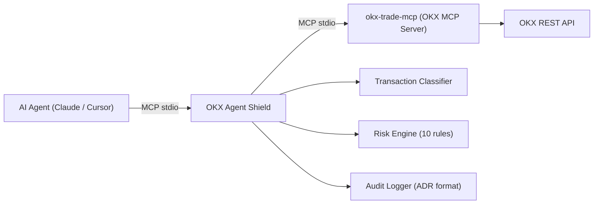
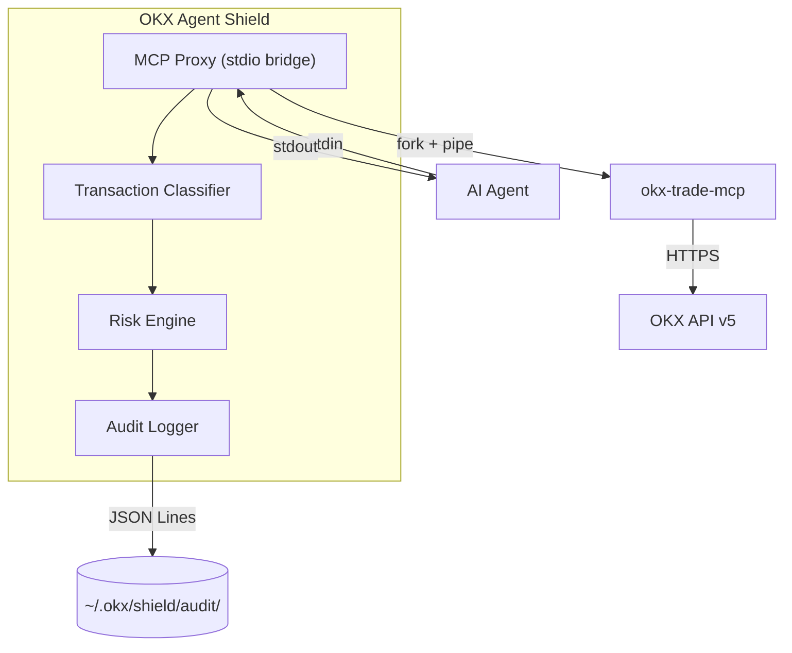

# OKX Agent Shield

> **Transaction Security Middleware for OKX Agent Trade Kit**  
> AI Agent 与 OKX 交易 API 之间的安全闸门

[](https://www.typescriptlang.org/)
[](https://nodejs.org/)
[](https://modelcontextprotocol.io/)
[](LICENSE)

---

## What is this

**OKX Agent Shield** is the first transaction security middleware for the [OKX Agent Trade Kit](https://github.com/okx/agent-trade-kit) ecosystem. It sits between your AI Agent and the OKX trading API, intercepting every transaction request for real-time risk assessment — directly addressing the [pre-execution verification need](https://github.com/okx/agent-trade-kit/issues/23) raised by the community.



## Why it matters

When an AI Agent connects to your OKX account, it gains access to **164 trading tools** — spot orders, leveraged contracts, account transfers, and more. A compromised or misled Agent can execute dangerous trades in seconds.

OKX Agent Trade Kit provides `readOnly` and `demo` modes, but these are coarse-grained on/off switches. **Shield provides fine-grained, per-transaction risk control**:

| Shield Feature | OKX Built-in Equivalent |
|---------------|------------------------|
| Per-transaction amount limits | Not available |
| Daily volume caps | Not available |
| Trading frequency limits | Not available |
| Instrument whitelist/blacklist | Not available |
| Leverage caps | Not available |
| Mandatory stop-loss checks | Not available |
| Full audit trail (ADR) | Not available |
| Fine-grained policy profiles | `readOnly` / `demo` only |

## Real-world examples

```
Agent: "Buy 10 BTC"
Shield: BLOCKED - Single order $650,000 exceeds policy limit ($1,000)

Agent: "Check my account balance"
Shield: PASSED - Query operations allowed directly

Agent: "Open 50x leveraged long on ETH"
Shield: BLOCKED - Leverage 50x exceeds policy limit (3x)
```

## Architecture



**Design choice**: MCP stdio proxy mode (not HTTP middleware) because OKX Agent Trade Kit's MCP Server communicates via stdio JSON-RPC. Shield acts as a transparent proxy - no changes needed to the Agent or the OKX MCP Server.

See [ARCHITECTURE.md](ARCHITECTURE.md) for detailed design documentation.

## Core components

| Component | File | Responsibility |
|-----------|------|---------------|
| MCP Proxy | `src/proxy/mcp-proxy.ts` | stdio message forwarding, tool call interception |
| JSON-RPC Framer | `src/proxy/json-rpc-framer.ts` | Message delimiting over stdio streams |
| Transaction Classifier | `src/risk/transaction-classifier.ts` | Categorizes 164 OKX tools by risk level |
| Risk Engine | `src/risk/risk-engine.ts` | Evaluates 10 risk rules per transaction |
| Audit Logger | `src/audit/audit-logger.ts` | Generates Agent Decision Records (ADR) |
| Config Manager | `src/config/config-manager.ts` | Multi-policy configuration management |

## Risk rules (10)

| ID | Rule | Default (Conservative) |
|----|------|----------------------|
| RISK-001 | Single order amount limit | $500 USD |
| RISK-002 | Daily volume limit | $2,000 USD |
| RISK-003 | Contract notional limit | $2,000 USD |
| RISK-004 | Max leverage | 1x |
| RISK-005 | Order frequency | 3 / hour |
| RISK-006 | Instrument whitelist | BTC-USDT, ETH-USDT |
| RISK-007 | Instrument blacklist | MEME tokens |
| RISK-008 | Mandatory stop-loss | Required |
| RISK-009 | Allowed operation types | Spot + query only |
| RISK-010 | Daily loss limit | $200 USD |

## Policy profiles

| Dimension | Conservative | Moderate | Demo |
|-----------|:----------:|:--------:|:----:|
| Single order limit | $500 | $5,000 | $100 |
| Daily volume | $2,000 | $25,000 | $500 |
| Max leverage | 1x | 3x | 1x |
| Hourly orders | 3 | 15 | 1 |
| Allowed pairs | BTC, ETH | BTC, ETH, SOL, XRP | BTC |
| Stop-loss required | Yes | No | Yes |
| Allowed operations | Spot + query | Spot + swap + query | Spot + query |

## Quick start

### 1. Install

```bash
npm install -g okx-agent-shield
```

### 2. Configure your MCP Host

**Claude Desktop** (`~/Library/Application Support/Claude/claude_desktop_config.json`):

```json
{
  "mcpServers": {
    "okx-shield": {
      "command": "npx",
      "args": ["okx-agent-shield", "--policy", "conservative"]
    }
  }
}
```

### 3. Check policy

```bash
okx-agent-shield config
```

### 4. Switch policy

```bash
okx-agent-shield config --policy moderate
```

### 5. View audit log

```bash
okx-agent-shield audit --today
```

## Audit log format (ADR)

Each transaction generates an **Agent Decision Record** in JSON Lines format, stored at `~/.okx/shield/audit/`:

```json
{
  "adr_id": "adr_20250702_143052_a1b2c3",
  "timestamp": "2025-07-02T14:30:52.123Z",
  "shield_decision": {
    "action": "BLOCKED",
    "reason": "Single order amount exceeds limit",
    "confidence": 1.0
  },
  "transaction_request": {
    "tool": "spot_order",
    "params": { "instId": "BTC-USDT", "side": "buy", "sz": "1" }
  },
  "risk_assessment": {
    "notional_usd": 65000,
    "category": "spot_order",
    "triggered_rules": ["RISK-001"]
  },
  "shield_config_version": "0.1.0"
}
```

## Project structure

```
okx-agent-shield/
├── src/
│   ├── index.ts                    # CLI entry
│   ├── proxy/
│   │   ├── mcp-proxy.ts            # MCP stdio proxy
│   │   └── json-rpc-framer.ts      # Message framing
│   ├── risk/
│   │   ├── transaction-classifier.ts  # 164-tool classifier
│   │   └── risk-engine.ts          # 10-rule risk engine
│   ├── audit/
│   │   └── audit-logger.ts         # ADR audit logging
│   ├── config/
│   │   ├── config-manager.ts       # Policy management
│   │   └── default-policy.ts       # 3 built-in policies
│   └── types/
│       ├── mcp.types.ts            # MCP protocol types
│       └── shield.types.ts         # Domain types
├── tests/
├── ARCHITECTURE.md                 # Detailed architecture doc
├── package.json
└── tsconfig.json
```

## Tech stack

- **TypeScript 5.3+** - type-safe implementation
- **Node.js 18+** - native fetch, modern APIs
- **commander** - CLI framework
- **chalk v4** - terminal colors
- **MCP stdio** - JSON-RPC over standard I/O
- **vitest** - testing framework

## Roadmap

- [x] V0.1.0 MCP Proxy + real-time risk engine + ADR audit logging
- [ ] V0.2.0 Prompt Sanitizer - detect prompt injection in trading commands
- [ ] V0.3.0 Human-in-the-loop - desktop notifications for high-risk operations
- [ ] V0.4.0 Web audit dashboard - visualize Agent operations and alerts
- [ ] V0.5.0 Submit to [OKX Onchain OS Plugin Store](https://web3.okx.com/zh-hans/onchainos)

## License

MIT

---

<p align="center"><sub>Built for the OKX Agent ecosystem</sub></p>
